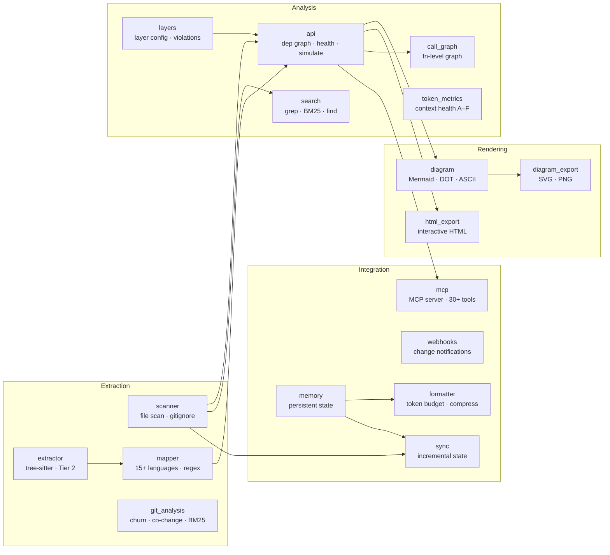
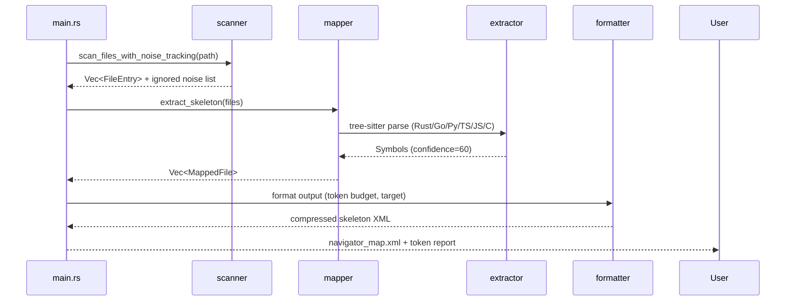
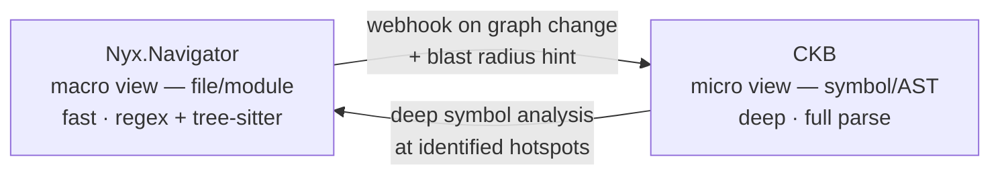

# Nyx.Navigator

> Deterministic codebase mapper for AI context injection.

Nyx.Navigator packages your repository into a structured snapshot an AI can reason about. It sits between your codebase and your AI assistant — Claude, Cursor, GPT-4, or any model with a context window.

## How it works

1. Run `navigator` in any repo
2. Pick a mode — map (skeletons) or source (full content)
3. The snapshot is written to disk and optionally copied to clipboard
4. Paste it into your AI chat, or let the MCP server inject it automatically

```
  Project : my-app  (42 source files)

  map     ~18k tokens   signatures & structure only   (recommended)
  source  ~310k tokens  full file content
  diagram               visualise dependency graph
  query                 answer a specific question about the code

What would you like to do? [map/source/diagram/query/quit]:
```

## Quick Start

```bash
# Build and install
cd mapper-core/nyx-navigator && cargo build --release
cp target/release/navigator ~/.local/bin/navigator

# Initialise project config
navigator init

# Interactive overview — shows token estimates, lets you pick a mode
navigator

# Or go directly
navigator map      # skeleton only (~90% fewer tokens than full source)
navigator source   # full source code
navigator query "how does authentication work?"
```

## Context Modes

| Command | What it sends | When to use |
|---------|--------------|-------------|
| `navigator map` | Imports + signatures only | Daily use, architecture questions |
| `navigator source` | Full file content | Debugging, implementation review |
| `navigator copy` | Full source to clipboard only (no disk write) | One-shot paste |
| `navigator context --focus <FILE> --budget 8000` | PageRank-ranked skeleton pruned to token budget | Targeted deep dives |
| `navigator query <QUESTION>` | Search → PageRank → skeleton in one step | Specific questions |
| `navigator sync` | Incremental update (changed files only) | Keep snapshot fresh |
| `navigator watch` | Live watcher, updates skeleton on save | Ongoing sessions |

## Architecture & Analysis

| Command | Description |
|---------|-------------|
| `navigator health` | Health score 0–100 (cycles, bridges, god modules, violations) |
| `navigator simulate --module <FILE>` | Predict ripple effects before making a change |
| `navigator check` | CI gate — exits non-zero on cycles or layer violations |
| `navigator dead` | Dead code candidates (in-degree = 0) |
| `navigator symbols --unreferenced` | Public exports not referenced anywhere |
| `navigator hotspots` | High churn × high complexity files |
| `navigator cochange --min-count 3` | Temporal coupling — files that always change together |
| `navigator shotgun` | Shotgun surgery candidates (high co-change dispersion) |
| `navigator semidiff HEAD~1` | Function-level semantic diff between two commits |
| `navigator evolution --days 30` | Architectural trends over time |
| `navigator path <A> <B>` | Shortest import path between two modules |
| `navigator deps <MODULE>` | Dependencies of a module as JSON |
| `navigator todo` | TODO/FIXME/HACK density across source files |
| `navigator languages` | Languages detected and their file counts |

## Diagram

| Command | Description |
|---------|-------------|
| `navigator diagram` | Dependency graph (Mermaid by default) |
| `navigator diagram --format dot\|ascii` | Graphviz DOT or ASCII tree |
| `navigator diagram -o graph.html` | Interactive self-contained HTML explorer |
| `navigator diagram -o graph.svg\|.png` | SVG/PNG via `mmdc` or `dot` |
| `navigator diagram --call-graph FILE` | Function-level call graph for a single file (Rust/Python) |
| `navigator diagram --blast-radius MODULE` | Target + direct deps + direct dependents |
| `navigator diagram --focus FILE [--depth N]` | BFS neighborhood around a module |
| `navigator diagram --group-by-folder DEPTH` | Collapse graph to folder granularity |
| `navigator diagram --color-by-owner` | Node fill by dominant git author |
| `navigator diagram --cochange-threshold N` | Overlay co-change edges |
| `navigator diagram --docs-only` | Doc-map: Markdown/YAML/TOML/JSON + referenced code |

### Examples — this repo

**Full module dependency graph** (`navigator diagram --format dot -o graph.svg`)


**Blast radius of `api.rs`** — the central hub and everything it pulls (`navigator diagram --blast-radius src/api.rs --format dot -o blast.svg`)


**Focus neighborhood of `main.rs`** — direct imports only (`navigator diagram --focus src/main.rs --depth 1 --format dot -o focus.svg`)


**Function-level call graph for `diagram.rs`** (`navigator diagram --call-graph src/diagram.rs --format dot -o calls.svg`)


## Search & File Tools

| Command | Description |
|---------|-------------|
| `navigator search <PATTERN>` | Grep-like content search (`-i -v -w -A -B -C`, `--glob`, `--path`) |
| `navigator find <PATTERN>` | File find by glob (`--modified-since 24h`, `--min-size`, `--max-depth`) |
| `navigator replace <PATTERN> <REPLACEMENT>` | Regex find-and-replace (`--dry-run`, `--backup`, capture groups) |
| `navigator extract <PATTERN>` | Capture-group extraction (`--format text\|json\|csv\|tsv`) |

## Context Quality

| Command | Description |
|---------|-------------|
| `navigator context-health [FILE]` | Score a context bundle: signal density, entropy, position health (A–F) |
| `navigator llmstxt` | Generate `llms.txt` project index |
| `navigator claudemd` | Generate `CLAUDE.md` architecture guide |

## Layers & Snapshots

| Command | Description |
|---------|-------------|
| `navigator layers` | Manage architectural layer definitions (`layers.toml`) |
| `navigator snapshot` | Save or compare architecture snapshots |
| `navigator status` | Show project status |

## MCP Server

```bash
navigator serve   # stdio JSON-RPC 2.0 — connects to Claude Code, Cursor, etc.
```

Exposes 30+ tools over Model Context Protocol including `get_blast_radius`, `renderArchitecture`, `search_content`, `hotspots`, `cochange`, `semidiff`, `doc_index`, and `query_context`.

`renderArchitecture` returns Mermaid or DOT directly — IDEs that render Mermaid inline get paste-able diagrams without extra tooling.

## Layer Enforcement

Prevent architectural drift with `layers.toml`:

```toml
[layers]
ui = ["components", "pages"]
services = ["api", "auth"]
db = ["models"]

[allowed_flows]
ui -> services
services -> db
```

Detects: BackCalls (db→ui), SkipCalls (ui→db), CircularCrossLayer, DirectForeignImport.

## Architecture

### Module dependency graph



### How `navigator map` flows



## Token Efficiency

`map` mode achieves **~90% token reduction** vs full source:
- Full source: ~5,000 tokens/module
- Skeleton: ~200 tokens/module

`context-health` scores bundles on six metrics: signal density, compression density, position health, entity density, utilisation headroom, dedup ratio. Composite score A–F.

## Nyx.Navigator vs CKB

| Aspect | Nyx.Navigator | CKB |
|--------|--------------|-----|
| View | Macro (file/module) | Micro (symbol/AST) |
| Speed | Fast (regex + tree-sitter) | Deep (AST) |
| Purpose | Map, warn, predict, inject context | Analyze, refactor |
| Output | Skeleton XML / source context | Call graphs, refs |

**The handoff:** Nyx.Navigator identifies where to look; CKB does deep analysis there.



## Author

SimplyLiz
