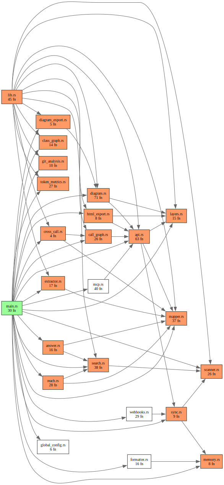
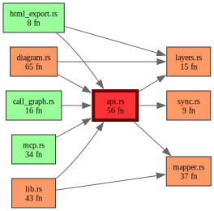
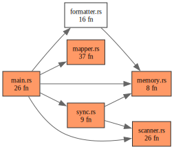
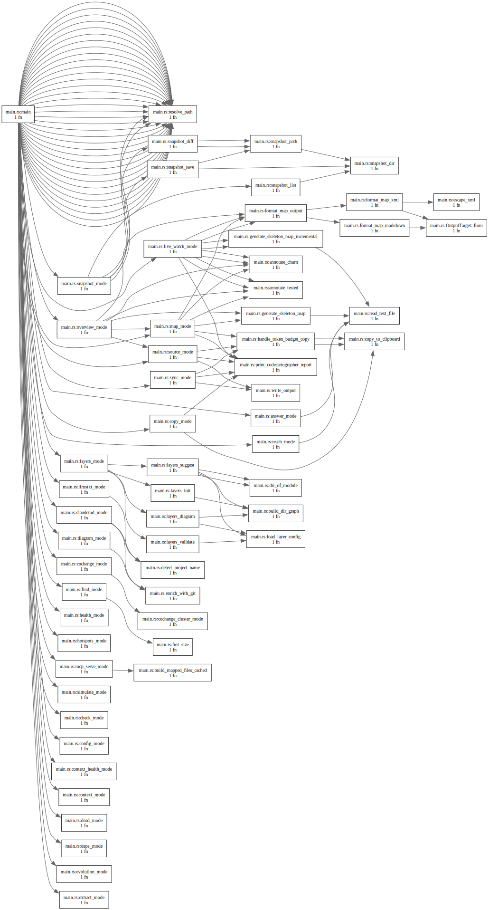
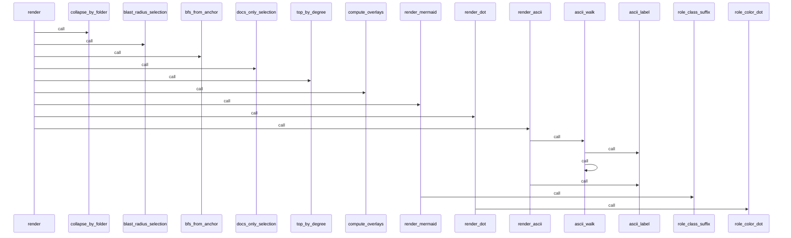
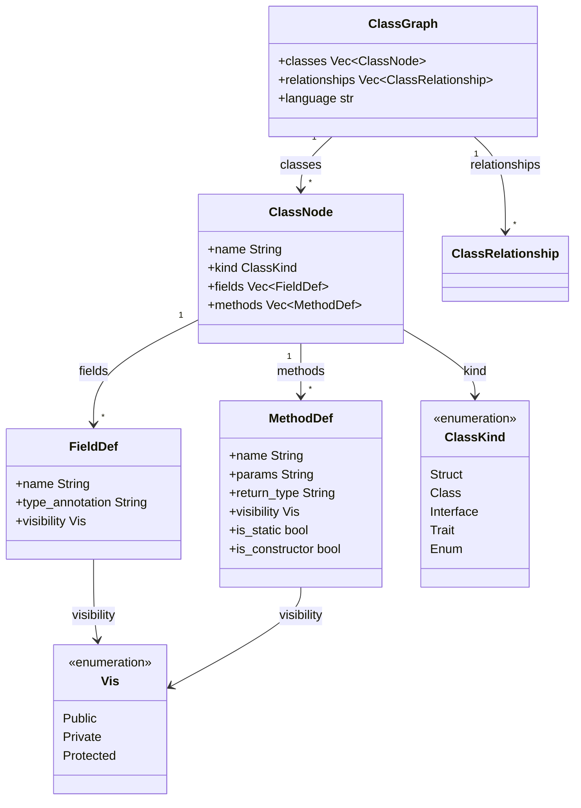
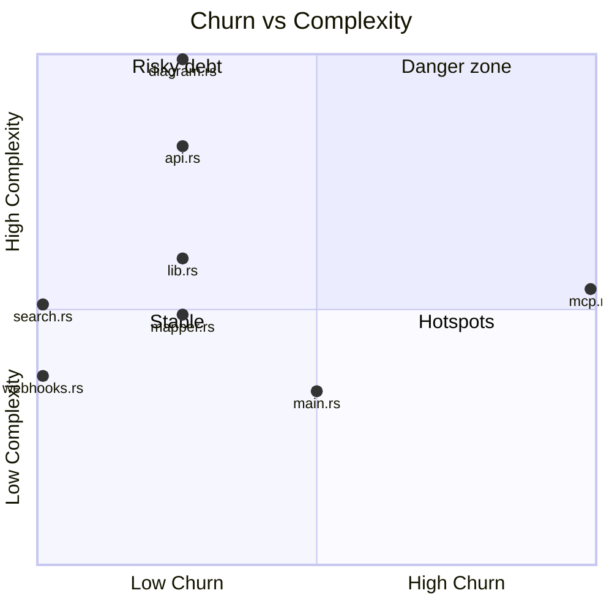
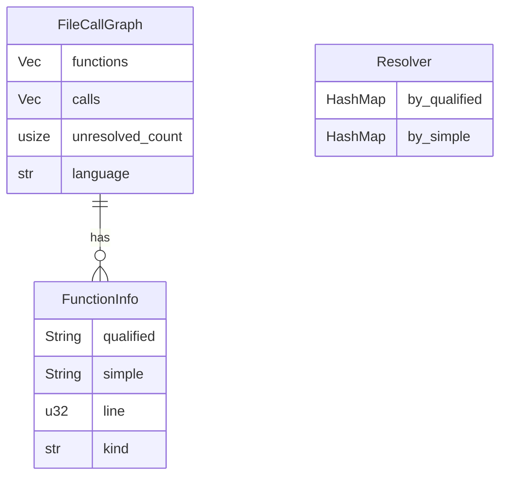
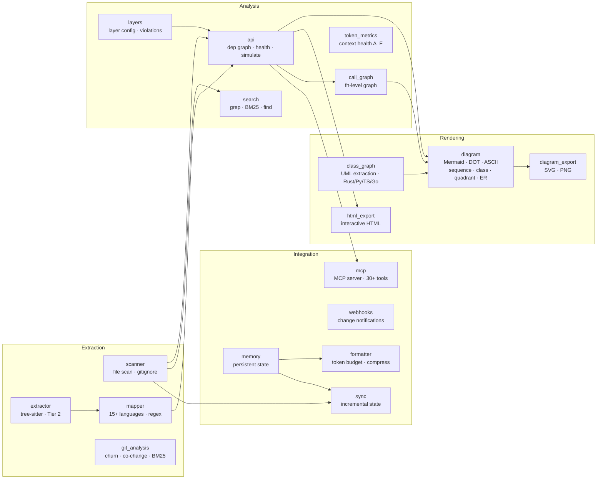
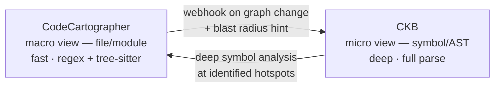

# CodeCartographer

> Deterministic codebase mapper for AI context injection.

CodeCartographer packages your repository into a structured snapshot an AI can reason about. It sits between your codebase and your AI assistant — Claude, Cursor, GPT-4, or any model with a context window.

## How it works

1. Run `codecartographer` in any repo
2. Pick a mode — map (skeletons) or source (full content)
3. The snapshot is written to disk and optionally copied to clipboard
4. Paste it into your AI chat, or let the MCP server inject it automatically

```
  Project : my-app  (42 source files)

  map     ~18k tokens   signatures & structure only   (recommended)
  source  ~310k tokens  full file content
  diagram               visualise dependency graph
  query                 answer a specific question about the code

What would you like to do? [map/source/diagram/query/quit]:
```

## Quick Start

```bash
# Build and install
cd mapper-core/CodeCartographer && cargo build --release
cp target/release/codecartographer ~/.local/bin/codecartographer

# Optional: renderers for exporting diagrams to SVG/PNG (core features need neither)
#   mmdc — Mermaid: npm install -g @mermaid-js/mermaid-cli
#   dot  — Graphviz: brew install graphviz
# Run `codecartographer doctor` any time to see what's installed.

# Initialise project config
codecartographer init

# Interactive overview — shows token estimates, lets you pick a mode
codecartographer

# Or go directly
codecartographer map      # skeleton only (~90% fewer tokens than full source)
codecartographer source   # full source code
codecartographer query "how does authentication work?"
```

## Context Modes

| Command | What it sends | When to use |
|---------|--------------|-------------|
| `codecartographer map` | Imports + signatures only | Daily use, architecture questions |
| `codecartographer source` | Full file content | Debugging, implementation review |
| `codecartographer copy` | Full source to clipboard only (no disk write) | One-shot paste |
| `codecartographer context --focus <FILE> --budget 8000` | PageRank-ranked skeleton pruned to token budget | Targeted deep dives |
| `codecartographer query <QUESTION>` | Search → PageRank → skeleton in one step | Specific questions |
| `codecartographer sync` | Incremental update (changed files only) | Keep snapshot fresh |
| `codecartographer watch` | Live watcher, updates skeleton on save | Ongoing sessions |

## Language support

Cartographer is a **lightweight, tree-sitter navigator** — it maps a repo fast so an AI can
find its way. It is deliberately *not* a compiler: for macro-aware include resolution,
type-resolved calls, or data-flow, it defers to CKB. Quality below is measured against the
navigation bar ("point me at the right symbol/file"), not compiler precision.

| Language | Symbols | Imports | Call graph¹ | Class diagram | Notes / caveats |
|----------|:------:|:------:|:----------:|:------------:|-----------------|
| Rust | Full | ✅ | ✅ | ✅ | enum variants & struct fields not itemised |
| Python | Full | ✅ | ✅ | ✅ | decorators applied but not surfaced; module consts = ALL-CAPS only |
| Go | Full | ✅ | ✅ | ✅ | struct fields / interface methods not itemised |
| TypeScript | Full | ✅ | — | ✅ | generics/namespaces not itemised; const-arrow fns captured |
| JavaScript | Full | ✅ | — | — | const-arrow fns captured |
| C | Full | ✅ `#include` | ✅ | — | macros partial; fields not itemised |
| C++ | Full | ✅ `#include` | ✅ | — | templates/macros partial; `#include` resolved heuristically (no `-I`/macro expansion — CKB's job) |
| Java | Full | ✅ | ✅ | ✅ | classes/interfaces/enums/methods/fields; extends/implements |
| C# | Full | ✅ | ✅ | ✅ | classes/structs/interfaces/enums/methods/properties |
| Kotlin | Full | ✅ | ✅ | ✅ | classes/objects/functions/properties |
| Swift | Full | ✅ | ✅ | ✅ | class/struct/enum all reported as types; protocols captured |
| PHP | Full | ✅ | ✅ | ✅ | classes/interfaces/traits/enums/functions/methods |
| Ruby | Full | ✅ `require` | ✅ | ✅ | `def…end`; paren-less calls resolved when unambiguous; `module` not drawn as a class |

**Full** = symbols + imports + call graph + class diagram. **Good** = symbols + imports only.

¹ *Call graph* = file-local **callee** resolution. `reach_symbol` **callers** are found by text
search and work for **every** language, new ones included.

## Architecture & Analysis

| Command | Description |
|---------|-------------|
| `codecartographer health` | Health score 0–100 (cycles, bridges, god modules, violations) |
| `codecartographer simulate --module <FILE>` | Predict ripple effects before making a change |
| `codecartographer check` | CI gate — exits non-zero on cycles or layer violations |
| `codecartographer dead` | Dead code candidates (in-degree = 0) |
| `codecartographer symbols --unreferenced` | Public exports not referenced anywhere |
| `codecartographer hotspots` | High churn × high complexity files |
| `codecartographer cochange --min-count 3` | Temporal coupling — files that always change together |
| `codecartographer shotgun` | Shotgun surgery candidates (high co-change dispersion) |
| `codecartographer semidiff HEAD~1` | Function-level semantic diff between two commits |
| `codecartographer evolution --days 30` | Architectural trends over time |
| `codecartographer path --from <A> --to <B>` | Shortest import path between two modules |
| `codecartographer deps <MODULE>` | Dependencies of a module as JSON |
| `codecartographer todo` | TODO/FIXME/HACK density across source files |
| `codecartographer languages` | Languages detected and their file counts |

## Diagram

| Command | Description |
|---------|-------------|
| `codecartographer diagram` | Dependency graph (Mermaid by default) |
| `codecartographer diagram --format dot\|ascii` | Graphviz DOT or ASCII tree |
| `codecartographer diagram -o graph.html` | Interactive self-contained HTML explorer |
| `codecartographer diagram -o graph.svg\|.png` | SVG/PNG via `mmdc` or `dot` |
| `codecartographer diagram --call-graph FILE` | Function-level call graph for a single file (Rust/Python/Go/C/C++) |
| `codecartographer diagram --call-graph FILE --format sequence` | Mermaid `sequenceDiagram` — function call order within a file |
| `codecartographer diagram --call-graph FILE --format class` | Mermaid `classDiagram` — structs, classes, interfaces with fields and relationships |
| `codecartographer diagram --format quadrant` | Mermaid `quadrantChart` — churn × complexity scatter (top-right = refactor now) |
| `codecartographer diagram --call-graph FILE --format er` | Mermaid `erDiagram` — entity-relationship view inferred from struct fields and type annotations |
| `codecartographer diagram --blast-radius MODULE` | Target + direct deps + direct dependents |
| `codecartographer diagram --focus FILE [--depth N]` | BFS neighborhood around a module |
| `codecartographer diagram --group-by-folder DEPTH` | Collapse graph to folder granularity |
| `codecartographer diagram --color-by-owner` | Node fill by dominant git author |
| `codecartographer diagram --cochange-threshold N` | Overlay co-change edges |
| `codecartographer diagram --docs-only` | Doc-map: Markdown/YAML/TOML/JSON + referenced code |

Sequence, class, quadrant, and ER formats all output Mermaid syntax, so `--output out.svg` works via `mmdc` and IDEs that render Mermaid inline get diagrams without extra tooling.

### Examples — this repo

**Full module dependency graph** (`codecartographer diagram --format dot -o graph.svg`)



**Blast radius of `api.rs`** — the central hub and everything it pulls (`codecartographer diagram --blast-radius src/api.rs --format dot -o blast.svg`)



**Focus neighborhood of `main.rs`** — direct imports only (`codecartographer diagram --focus src/main.rs --depth 1 --format dot -o focus.svg`)



**Function-level call graph for `diagram.rs`** (`codecartographer diagram --call-graph src/diagram.rs --format dot -o calls.svg`)



**Sequence diagram of `diagram.rs`** — function call order within the renderer (`codecartographer diagram --call-graph src/diagram.rs --format sequence`)



**Class diagram of `class_graph.rs`** — the UML extraction data model (`codecartographer diagram --call-graph src/class_graph.rs --format class`)



**Quadrant chart — churn × complexity** (`codecartographer diagram --format quadrant`)

> Bottom-left = stable (leave it). Top-right = danger zone (refactor now). Top-left = risky debt (complex but rarely touched — schedule a refactor). Bottom-right = hotspots (high churn but simple — add tests).



**ER diagram of `call_graph.rs`** — entity-relationship view of the call-graph data model (`codecartographer diagram --call-graph src/call_graph.rs --format er`)



## Semantic Traversal

Two commands for AI-optimised, symbol-level context — much tighter than a full skeleton.
`reach` is the recommended starting point for symbol discovery: give it a bare name and it
returns the definition, callers, and callees.

| Command | Description |
|---------|-------------|
| `codecartographer reach <SYMBOL>` | Context tree from a named symbol: callers with snippets, callees with sigs, depth-2 types. 135–500 tokens. |
| `codecartographer reach <A> <B>` | Intersection view: merged callers, shared callees annotated, shared depth-2 types promoted. |
| `codecartographer answer "<QUESTION>"` | Evidence chain: minimum symbols that answer the question, in reading order with inter-item connections. |
| `codecartographer answer "<QUESTION>" --then N` | Drill into evidence item #N via `reach`, appended below the chain. |

```bash
# Single symbol — who calls it, what it calls, what types it touches
codecartographer reach verify_token

# Two symbols — shared context between them
codecartographer reach verify_token decode_jwt

# Question → ranked evidence chain
codecartographer answer "how does rate limiting work?"

# Drill into item #2 for more detail
codecartographer answer "how does the call graph work?" --then 2
```

Callee resolution uses AST call graphs for Rust, Python, Go, C, and C++; other languages fall back to import-graph heuristics.

## Search & File Tools

| Command | Description |
|---------|-------------|
| `codecartographer search <PATTERN>` | Grep-like content search (`-i -v -w -A -B -C`, `--glob`, `--path`) |
| `codecartographer find <PATTERN>` | File find by glob (`--modified-since 24h`, `--min-size`, `--max-depth`) |
| `codecartographer replace <PATTERN> <REPLACEMENT>` | Regex find-and-replace (`--dry-run`, `--backup`, capture groups) |
| `codecartographer extract <PATTERN>` | Capture-group extraction (`--format text\|json\|csv\|tsv`) |

## Context Quality

| Command | Description |
|---------|-------------|
| `codecartographer context-health [FILE]` | Score a context bundle: signal density, entropy, position health (A–F) |
| `codecartographer llmstxt` | Generate `llms.txt` project index |
| `codecartographer claudemd` | Generate `CLAUDE.md` architecture guide |

## Layers & Snapshots

| Command | Description |
|---------|-------------|
| `codecartographer layers` | Manage architectural layer definitions (`layers.toml`) |
| `codecartographer snapshot` | Save or compare architecture snapshots |
| `codecartographer status` | Show project status |

## MCP Server

```bash
codecartographer serve                 # full toolset — stdio JSON-RPC 2.0 (Claude Code, Cursor, …)
codecartographer serve --preset=core   # lean 12-tool discovery surface (also CARTOGRAPHER_PRESET=core)
```

Exposes 40+ tools over Model Context Protocol. The server is long-lived: it scans once at
startup, then **refreshes incrementally** so mid-session edits (including uncommitted ones)
are reflected without a restart. Every tool that takes a file/module/symbol accepts a
canonical **`target`** argument (the tool's original argument name still works). For huge
repos and C/C++ specifics, see [Working with large codebases & C/C++](docs/user/mcp-tools.md#working-with-large-codebases--cc).

Skeleton tools:

| Tool | Description |
|------|-------------|
| `skeleton_map` | Full project skeleton (all files) |
| `ranked_skeleton` | Token-budget skeleton ranked by PageRank, optionally personalised to focus files |
| `focused_skeleton` | Seed file + N import-hops (importers + importees), enriched with churn and test markers |
| `diff_skeleton` | Files changed between two commits + their immediate importers |
| `search_skeleton` | Skeleton sections for files matching a keyword — path-first, then symbol names |

Other highlights: `get_blast_radius`, `renderArchitecture`, `search_content`, `semidiff`, `doc_index`, `query_context`, `shotgun_surgery`, `context_health`.

`renderArchitecture` returns Mermaid or DOT directly — IDEs that render Mermaid inline get paste-able diagrams without extra tooling.

## Layer Enforcement

Prevent architectural drift with `layers.toml`:

```toml
[layers]
ui = ["components", "pages"]
services = ["api", "auth"]
db = ["models"]

[allowed_flows]
ui -> services
services -> db
```

Detects: BackCalls (db→ui), SkipCalls (ui→db), CircularCrossLayer, DirectForeignImport.

## Architecture

### Module dependency graph



### How `codecartographer map` flows


## Token Efficiency

`map` mode achieves **~90% token reduction** vs full source:
- Full source: ~5,000 tokens/module
- Skeleton: ~200 tokens/module

`context-health` scores bundles on six metrics: signal density, compression density, position health, entity density, utilisation headroom, dedup ratio. Composite score A–F.

## CodeCartographer vs CKB

| Aspect | CodeCartographer | CKB |
|--------|--------------|-----|
| View | Macro (file/module) | Micro (symbol/AST) |
| Speed | Fast (regex + tree-sitter) | Deep (AST) |
| Purpose | Map, warn, predict, inject context | Analyze, refactor |
| Output | Skeleton XML / source context | Call graphs, refs |

**The handoff:** CodeCartographer identifies where to look; CKB does deep analysis there.



## Author

SimplyLiz
