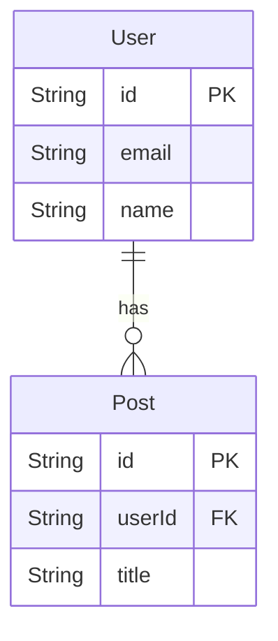

# Planned Diagram Types

Three follow-up diagram formats identified after shipping sequence + class diagrams (PR #7). Ordered by implementation cost vs developer value.

---

## 1. Quadrant Chart — Churn × Complexity

**Priority: next PR.**

### What it is

`navigator diagram --format quadrant` plots every file as a point on a churn × complexity plane. Top-right quadrant = high churn + high complexity = the files that hurt most and are changed most often. Gives teams an immediate, visual answer to "where should we refactor?"

```
              │ High complexity
              │
  Risky debt  │  Danger zone
  (refactor   │  (refactor now)
  candidate)  │
──────────────┼──────────────
  Stable      │  Hotspots
  (ignore)    │  (add tests)
              │
              │ Low complexity
     Low churn│               High churn
```

Mermaid `quadrantChart` (added v10, already in our `mmdc` target) renders this directly.

### Why it's the easiest win

Both axes already live on `GraphNode`:
- `churn: Option<usize>` — git commit count
- `complexity: Option<u32>` — cyclomatic complexity from tree-sitter

No new extraction. Pure rendering addition. The selection/truncation logic from `top_by_degree` can be reused to cap node count.

### Implementation sketch

New `render_quadrant(graph, opts)` in `diagram.rs`. Selection: same `top_by_degree` fallback, focus/blast-radius if set. Output:

```
quadrantChart
    title Churn vs Complexity
    x-axis Low Churn --> High Churn
    y-axis Low Complexity --> High Complexity
    quadrant-1 Danger zone
    quadrant-2 Risky debt
    quadrant-3 Stable
    quadrant-4 Hotspots
    api.rs: [0.85, 0.90]
    diagram.rs: [0.40, 0.72]
    ...
```

Coordinates are normalised to `[0, 1]` across the included node set. Nodes without both metrics are omitted with a warning count (same pattern as `unresolved_count` in sequence diagrams).

`DiagramFormat::Quadrant`, parse arm `"quadrant"`. Routes through `export_mermaid()` — no export changes needed.

### Estimated scope

2–3 days. Single new function in `diagram.rs` + parse arm + main.rs branch. No new files, no new extraction.

---

## 2. Cross-File Sequence Traces

**Priority: spike first, then PR.**

### What it is

`navigator diagram --entry src/main.rs::diagram_mode --format sequence --depth 3` follows call edges *across* file boundaries from an entry point, producing a `sequenceDiagram` that shows how a request flows through the system. This is the thing developers actually want when onboarding: "trace this code path."

The current `--format sequence` is file-local by design (documented limitation in `call_graph.rs`). Cross-file traces require a project-wide call index.

### Why it matters

No other tool in this space does cross-file call tracing without a full language server. If we can approximate it — even imperfectly — it's a genuine differentiator. A sequence diagram that shows `diagram_mode → build_file_call_graph → to_project_graph → render → export_diagram` across four files is immediately useful to someone reading the codebase for the first time.

### The hard part

Resolution is the problem. Within a file, `self.foo()` can be resolved to a local function by simple-name matching. Across files:
- You need to know what `diagram::render` resolves to — which requires the import graph plus symbol indexing.
- Overloaded names (same function name in different modules) will collide.
- Dynamic dispatch (trait objects, function pointers) is unresolvable statically.

The existing import graph (`ProjectGraphResponse`) gives us module-level edges. The existing `extractor.rs` gives us per-module symbol lists. Combining them gives a two-level resolution:
1. Does the callee name match a symbol exported by a directly-imported module? → qualified match.
2. Does it match a symbol in any transitively-reachable module within `depth` hops? → heuristic match.

This is imprecise but useful in practice — most function names in a tight call path are unique enough.

### Implementation sketch

New module `cross_call.rs` (or extend `call_graph.rs`). Entry function:

```rust
pub fn trace_from_entry(
    entry_module: &str,
    entry_fn: &str,
    graph: &ProjectGraphResponse,
    signatures: &HashMap<String, Vec<Signature>>,
    depth: usize,
) -> CrossCallTrace
```

`CrossCallTrace` contains ordered `(module, fn_name)` pairs representing the call path. The renderer in `diagram.rs` emits one participant per unique module, one message per edge.

Requires `ApiState` (signature index) to be loaded — this path only makes sense as a server-side or post-scan operation, not standalone like the current `--call-graph FILE` path.

### Spike goal

Before committing to implementation: verify that simple-name + import-graph resolution gives useful (not garbage) results on this repo's own codebase. Run it on `diagram_mode` → expected to surface `call_graph`, `diagram`, `diagram_export` in order.

### Estimated scope

2–3 weeks for a solid implementation. 2–3 days for a spike to validate feasibility.

---

## 3. ER Diagrams for Data Models

**Priority: after quadrant chart.**

### What it is

`navigator diagram --call-graph FILE --format er` produces a Mermaid `erDiagram` by treating struct fields whose type names match other known structs as foreign-key relationships. Useful for files that define a data layer — ORM models, Prisma schemas, SQLx row types, TypeScript DTO interfaces.



### What we already have

`class_graph.rs` already extracts struct fields with names and type annotations. An ER renderer is largely a different view over the same data:
1. Take `ClassGraph.classes` — each becomes an entity.
2. For each `FieldDef`, check if `type_annotation` (after stripping `Option<>`, `Vec<>`, etc.) matches another class name → draw a relationship.
3. Infer cardinality from the wrapper type: `Option<T>` → zero-or-one, `Vec<T>` → one-to-many, bare `T` → exactly-one.

### What's missing

`class_graph.rs` doesn't currently extract a `is_primary_key` / `is_foreign_key` hint. These could be inferred from:
- Field name conventions (`id`, `*_id`, `*Id`)
- Attribute/derive macros (`#[primary_key]`, SQLx `#[sqlx(rename = ...)]`)
- Prisma schema syntax (separate parser path)

For a first version, skip PK/FK annotation entirely and just render entities + relationships inferred from type matching. That's already useful.

### Language coverage

- **Rust**: `class_graph.rs` already extracts fields with types. Type-matching works immediately.
- **TypeScript**: same — interfaces/classes with typed properties.
- **Python**: only works on dataclasses / typed `__init__` fields. Less useful without type annotations.
- **Go**: struct fields with types — good coverage for Go ORMs (GORM, sqlc).

### Estimated scope

3–5 days. New `render_er()` in `diagram.rs`. Type-stripping utility (unwrap `Option<T>` → `T`, `Vec<T>` → `T`). Relationship detection loop over field types. `DiagramFormat::Er`, parse arm `"er"`. Routes through `export_mermaid()`.

---

## Shipping order

| # | Feature | Effort | Data needed | Ships as |
|---|---------|--------|-------------|----------|
| 1 | Quadrant chart | 2–3 days | Already on `GraphNode` | Next PR after #7 |
| 2 | ER diagrams | 3–5 days | Already in `class_graph.rs` | Standalone PR |
| 3 | Cross-file sequence | 2–3 week + spike | Needs cross-file call index | Spike first |
