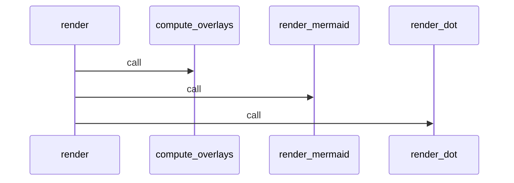
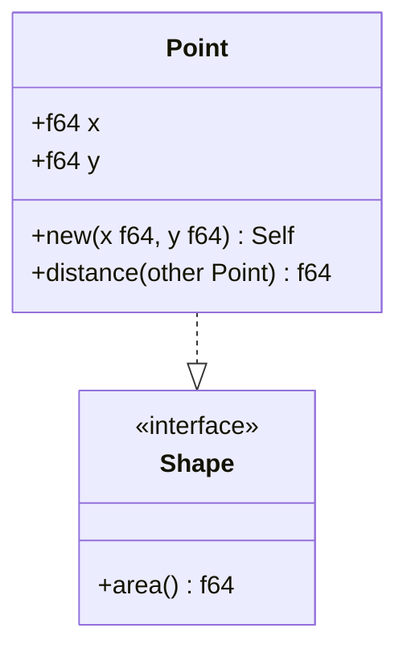

# Diagrams

`navigator diagram` turns the import graph into a diagram you can paste
into docs, open in a browser, or read in the terminal. One subcommand, three
dials: **format** (how the bytes look), **destination** (where they go), and
**selection** (which nodes make it in).

```
navigator diagram [OPTIONS]
```

All options are optional — calling `navigator diagram` with no flags
prints a Mermaid top-60-by-degree view of the current project to stdout.

---

## Output formats (`--format`)

| Value | Best for | Notes |
| --- | --- | --- |
| `mermaid` *(default)* | Markdown, MDX, GitHub READMEs, Notion, IDE previews | Renders inline anywhere Mermaid is supported. No external tool needed to read the source. |
| `dot` (alias: `graphviz`) | Poster-grade static images via Graphviz | Larger graphs render cleaner than Mermaid; lets you pipe to `dot` for SVG/PNG. |
| `ascii` (aliases: `tree`, `text`) | Terminals, chat messages, log files | Box-drawing tree rooted at a single node. Cycles break with an `↑ seen` marker so output is bounded. |
| `sequence` (alias: `seq`) | Understanding call order within a file | Mermaid `sequenceDiagram`. Requires `--call-graph FILE`. |
| `class` (alias: `uml`) | Onboarding, code review, data-model docs | Mermaid `classDiagram` with typed fields, method signatures, and relationship arrows. Requires `--call-graph FILE`. |

The format controls the **source** navigator emits. The destination
(below) controls whether that source gets written as-is, rendered to an
image, or wrapped in an interactive page.

`sequence` and `class` both emit Mermaid syntax, so `--output out.svg` works via `mmdc` and IDEs that render Mermaid inline show the diagram without extra tooling.

---

## Destinations (`-o, --output`)

With no `--output`, the diagram source prints to stdout. With `-o`, the
**file extension** decides what happens next:

| Extension | What we do | Required tool |
| --- | --- | --- |
| `.mmd`, `.dot`, `.txt`, anything else | Write diagram source verbatim | none |
| `.svg`, `.png` *(with* `--format mermaid`*)* | Shell out to `mmdc` | `npm install -g @mermaid-js/mermaid-cli` |
| `.svg`, `.png` *(with* `--format dot`*)* | Shell out to `dot` | `brew install graphviz` (or distro equivalent) |
| `.html` | Render a self-contained interactive explorer | none (no CDN, no build step) |

If the required binary isn't on `$PATH`, navigator errors out with the
install command instead of writing a broken file.

ASCII output can't be rendered to `.svg`/`.png` — pick `mermaid` or `dot`
for images, or write ASCII to any text extension.

### Interactive HTML

```bash
navigator diagram -o architecture.html
```

Produces a single file with a sidebar filter, click-to-select, and neighbor
lists annotated with cycle / layer-violation badges. Pure vanilla JS — open
it directly in a browser, commit it to a repo, or serve it from any static
host.

### Images

```bash
# Mermaid → SVG (requires mmdc)
navigator diagram -o architecture.svg

# DOT → PNG (requires Graphviz)
navigator diagram --format dot -o architecture.png
```

---

## Selection — which nodes make it in

Nyx.Navigator picks a subset of nodes to render because whole-project graphs
quickly become unreadable. Selection precedence from highest to lowest:

`--blast-radius` → `--focus` → `--docs-only` → top-N by degree *(default)*.

### Default: top-N by degree

No flags → the `--max-nodes` *(default 60)* most-connected nodes. Isolated
nodes are skipped. Raise the cap when you want more, lower it when the
output is noisy:

```bash
navigator diagram --max-nodes 20
```

A `(truncated to 60 nodes — raise --max-nodes for more)` notice prints when
the cap kicks in.

### `--focus MODULE [--depth N]` — neighborhood view

Anchors on a module and walks outward via undirected BFS. "Undirected"
because the neighborhood you care about when editing a file includes both
what it imports *and* what imports it.

```bash
navigator diagram --focus src/parser.rs --depth 2
```

`MODULE` accepts a `module_id`, an exact path, or a path suffix —
`--focus parser.rs` works if it's unambiguous.

### `--blast-radius MODULE` — impact view

Renders the target plus its direct dependencies and direct dependents only.
Target node renders as a bold red "epicenter". Useful for code review /
change-impact analysis: *"If I touch this, what will I affect?"*

```bash
navigator diagram --blast-radius src/api/auth.rs -o blast.svg
```

### `--docs-only` — doc-map view

Filters the selection to the documentation subgraph: every Markdown / YAML /
TOML / JSON node plus every code file they reference directly. Surfaces dead
docs (doc with no referenced code) and orphan code (code with no
documentation).

```bash
navigator diagram --docs-only -o doc-map.html
```

---

## Overlays — what the styling means

These are always on when the data is present. No flags required.

- **Thick red border** — node participates in an import cycle.
- **Dashed red border** — pivot node (the cycle's highest-coupling entry).
- **Red edges** — edges inside a cycle.
- **Dashed / dotted red, orange, yellow edges** — layer violations
  (back-call, skip-call, direct-foreign-import — see `navigator layers`).
- **Orange border + larger size (DOT)** — hotspot (`hotspot_score ≥ 70`).
- **Role fill colours** — `core` blue, `bridge` orange, `dead` grey,
  `entry` green (Mermaid / DOT only; overridden by `--color-by-owner`).
- **Bold red "epicenter" fill** — target of `--blast-radius`.
- **Doc nodes** — Mermaid stadium shape `([…])` with yellow fill, DOT
  `shape=note`.
- **Folder nodes** — DOT `shape=folder`, Mermaid `:::folder` class (blue fill).

Precedence on a node that's eligible for more than one: epicenter → pivot →
cycle → hot → default.

### `--cochange-threshold F` — temporal coupling overlay

Adds dotted purple edges between files that co-change (both touched in the
same commits) with a `coupling_score ≥ F`. Requires git history.

```bash
navigator diagram --cochange-threshold 0.6
```

Rough guide for the threshold: `0.3` is noisy, `0.6` catches suspicious
couplings, `0.8` only surfaces pairs that change together almost every time.

---

## Customisation

### `--group-by-folder DEPTH` — collapse to folders

Aggregate the graph at folder granularity *before* selection. `1` groups by
top-level directory (`src/`, `tests/`, …); `2` groups one level deeper
(`src/api/`, `src/db/`, …). Self-loops inside a folder are dropped;
inter-folder edges are summed.

```bash
navigator diagram --group-by-folder 2 -o folders.svg
```

Combines with `--focus` / `--blast-radius`, but the anchor has to match a
folder id on the collapsed graph (`src/api/` rather than
`src/api/auth.rs`).

### `--color-by-owner` — paint by git author

Replaces role-based fill colours with a stable palette keyed on the
dominant git author per file. Good for seeing team-ownership boundaries
overlaid on the import graph. Nodes without an inferred owner stay white.
Requires git history.

```bash
navigator diagram --color-by-owner -o ownership.svg
```

Bot commits and pure-formatting commits are filtered before ranking, so CI
bots and `rustfmt`-only changes don't skew the result.

### `--max-nodes N`

Default 60. Applies to every selection mode — truncation is by
least-connected first.

---

## File-level analysis (`--call-graph FILE`)

The `--call-graph FILE` flag switches from the project-wide import graph to
a **single-file analysis** mode. Three formats are available here, each
giving a different view of the same file:

| Format | Output | What it shows |
|--------|--------|---------------|
| `mermaid` / `dot` / `ascii` | Import-graph-style diagram | Function nodes + call edges in generic graph form |
| `sequence` | Mermaid `sequenceDiagram` | Call order as a sequence — who calls whom and when |
| `class` | Mermaid `classDiagram` | Structs, classes, interfaces — typed fields, method signatures, relationships |

Supported languages for `--call-graph`:

| Format | Rust | Python | TypeScript | Go |
|--------|------|--------|------------|----|
| `mermaid` / `dot` / `ascii` | ✓ | ✓ | | |
| `sequence` | ✓ | ✓ | | |
| `class` | ✓ | ✓ | ✓ | ✓ |

### Call graph (`--format mermaid|dot|ascii`)

```bash
navigator diagram --call-graph src/parser.rs --format ascii
```

- Nodes are functions / methods (qualified `Type::method` in Rust,
  `Class.method` in Python).
- Edges are caller → callee relations where the callee resolves to a
  function defined in the same file. Calls into the stdlib or other files
  are dropped.
- A trailing line reports how many external calls were dropped:

  ```
  Call graph: 24 functions, 54 edges, 229 unresolved external calls
  ```

### Sequence diagrams (`--format sequence`)

Shows the call relationships within a file as a Mermaid `sequenceDiagram`.
Participants are the functions defined in the file (in source order);
messages are call edges in AST order — a good approximation of execution
order for top-level flows. Self-calls render as loop arrows. Unresolved
external calls appear as a note so you can tell how much behaviour lives
outside the file.

```bash
navigator diagram --call-graph src/render.rs --format sequence
navigator diagram --call-graph src/render.rs --format sequence -o calls.svg
```



### Class diagrams (`--format class`)

Extracts the type structure of a file and renders it as a Mermaid
`classDiagram`. Useful for onboarding onto an unfamiliar data model, writing
architecture docs, or reviewing a PR's structural changes at a glance.

```bash
navigator diagram --call-graph src/models.rs --format class
navigator diagram --call-graph src/models.rs --format class -o models.svg
```

What's extracted per language:

**Rust** — `struct` fields (name, type, `pub`/private visibility), `enum`
variants, `trait` method signatures, `impl` methods attached to their type,
`impl Trait for Type` arrows (`..|>`).

**Python** — class declarations, base-class inheritance arrows (`--|>`),
instance fields from `__init__` (including type annotations), method
signatures (parameters, return type). Name-based visibility: `__` private,
`_` protected, rest public.

**TypeScript / TSX** — `class` fields with `public`/`private`/`protected`
modifiers, `extends` inheritance, `implements` interface arrows,
`interface` declarations with property and method signatures.

**Go** — `struct` fields (uppercase = public, lowercase = private), embedded
struct inheritance arrows, `interface` method sets, method declarations
attached to their receiver type.



Class-diagram mode ignores the import-graph-only options
(`--cochange-threshold`, `--docs-only`, `--group-by-folder`,
`--color-by-owner`) rather than erroring.

---

## Recipes

```bash
# Quick architecture snapshot to paste into a PR
navigator diagram --max-nodes 30

# Blast radius of a file, as a shareable image
navigator diagram --blast-radius src/api/auth.rs -o blast.svg

# Interactive explorer for the whole project, with ownership colours
navigator diagram --color-by-owner --max-nodes 200 -o architecture.html

# Folder-level bird's-eye view
navigator diagram --group-by-folder 2 --format dot -o folders.dot

# Doc-map: which docs point to which code
navigator diagram --docs-only -o doc-map.html

# ASCII tree rooted on the file you're about to edit (read in the terminal)
navigator diagram --focus src/parser.rs --depth 2 --format ascii

# Function-level call graph of one file
navigator diagram --call-graph src/parser.rs --format mermaid -o calls.mmd

# Temporal coupling overlay on a focused view
navigator diagram --focus src/api --cochange-threshold 0.6 -o coupling.svg

# Sequence diagram of a file's internal call flow (paste into a PR for reviewers)
navigator diagram --call-graph src/handler.rs --format sequence

# Sequence diagram rendered to SVG (requires mmdc)
navigator diagram --call-graph src/handler.rs --format sequence -o flow.svg

# Class diagram of a data-model file
navigator diagram --call-graph src/models.rs --format class

# Class diagram of a TypeScript service
navigator diagram --call-graph src/services/auth.ts --format class -o auth.svg

# Class diagram of a Go package
navigator diagram --call-graph internal/storage/repo.go --format class
```

---

## Programmatic access

The same renderer is reachable via FFI (`navigator_render_architecture`)
and the MCP tool `renderArchitecture`, so MCP-aware clients get the same
Mermaid / DOT / ASCII output without shelling out. CLI and MCP are
lock-step — if you see it in one, you see it in the other.
